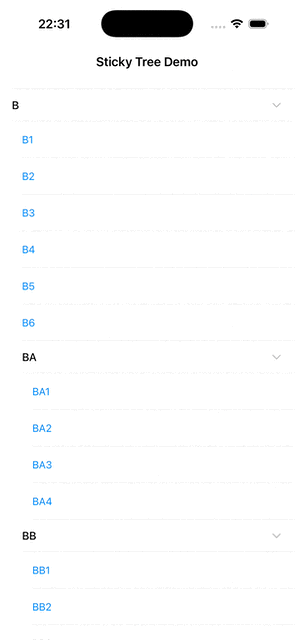

# StickyTree

一个 iOS / UIKit 演示工程,实现「**多级父链吸顶 + 展开折叠 + 分支/叶子混合渲染**」的树形列表。

滚动时,当前位置的所有祖先分支会按层级依次「叠在」列表顶部,形成一条从根到当前节点的父链;离开父链区域后,后续兄弟分支会把最深的吸顶项「顶」出去 —— 行为类似 VSCode 的 Sticky Scroll,但适配的是带展开折叠状态的树。



## 这是什么(以及不是什么)

- **是**:一个干净、可读、可单元测试的算法 + UIKit 装配演示,作为博客 / 作品集材料。
- **不是**:可以 `pod install` 或 `swift package add` 的库。没有公开 API 抛光,没有 SwiftPM/CocoaPods 发布,没有网络层、搜索、多选、下拉刷新这类「真实业务」功能。

## 工程结构

两套源码,以 UIKit 为边界刻意分开:

```
Packages/StickyTreeCore/          # 纯 Swift 算法包(SPM,只 import CoreGraphics)
└── Sources/StickyTreeCore/
    ├── StickyChainComputer.swift # 核心:(snapshot, visible, rect, offset, isBranch) → [DrawInstruction]
    ├── SnapshotReading.swift     # 树的最小只读接口(parent/level/isExpanded)
    └── DrawInstruction.swift     # 给 overlay 用的一条 pin 描述

StickyTree/StickyTree/    # iOS 应用,把 Core 接到 UIKit
├── Core/                         # 通用层:VC、Overlay、Config
├── Adapters/                     # NSDiffableDataSourceSectionSnapshot → SnapshotReading 适配
├── App/                          # SceneDelegate、RootViewController
└── Samples/Org/                  # 示例数据 + 渲染(组织架构树)
```

`StickyTreeCore` 不依赖 UIKit,因此可以在 macOS 上用 `swift test` 直接跑 —— 这也是算法层为什么独立成一个 SPM 包的原因。

## 运行

**iOS Demo**(需要 Xcode):

```bash
open StickyTree/StickyTree.xcodeproj
# 或命令行:
xcodebuild -project StickyTree/StickyTree.xcodeproj \
           -scheme StickyTree \
           -destination 'platform=iOS Simulator,name=iPhone 15' \
           build
```

**算法测试**(macOS,无需模拟器):

```bash
cd Packages/StickyTreeCore
swift build
swift test
```

## 算法 4 步概览

`StickyChainComputer.compute(...)` 是一个纯函数,输出一组 overlay 坐标系下的 pin 描述。核心步骤:

1. **Gate**:`pinLineY < 0.001` 直接返回空(没开始视觉滚动)。
2. **选锚点**:可见项里最后一个 `minY ≤ pinLineY` 的分支;若没有,回退到第一个 `maxY > pinLineY` 的项。
3. **建链**:从锚点向上走父指针到根,反转 → `chain`;再向下迭代,把已经完全进入吸顶区的「直接子分支」追加进去(防止下一层分支在吸顶前先消失)。
4. **挤出修正**:找锚点之后第一个 `level ≤ deepest.level` 的兄弟分支,如果它已经探入吸顶区,就把最深 pin 上推等量距离;若位移超过一个 `levelHeight`,直接丢掉最深这条。

更详细的不变量和边界用例,见 `Packages/StickyTreeCore/Tests/StickyTreeCoreTests/StickyChainComputerTests.swift` —— 测试用例就是验收标准。

## 环境

- Swift 5.9
- iOS 14+ / macOS 11+(算法包)
- Xcode 15+

## License

MIT,见 [LICENSE](./LICENSE)。
